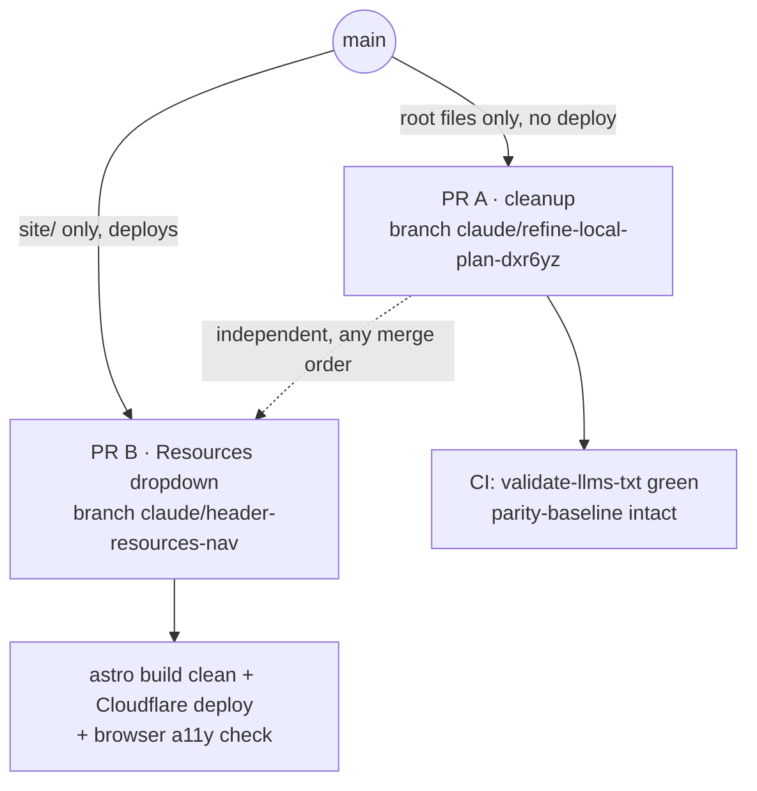

# Plan: Repo cleanup + header "Resources" dropdown

## Context

eagleridge.io migrated from a hand-written root-HTML GitHub Pages site to an
Astro site in `site/` (Cloudflare Pages; DNS cutover completed 2026-06-13). Two
debts remain, addressed here as two independent workstreams:

1. **Repo cleanup.** The entire legacy root-HTML site still sits in the repo
   root beside the live `site/` tree — duplicated, no longer served, and
   actively misleading (root `CLAUDE.md`/`README.md` still document it as *the*
   site). Verified: `deploy.yml` triggers only on `site/**` and ships only
   `site/dist`; nothing at the repo root is deployed. CI
   (`validate-llms-txt.yml`) reads `site/public/llms.txt` and
   `../parity-baseline/*.md` — no root file.
2. **Navigation IA.** All legacy pages are already ported to Astro (every page
   except the intentionally-dropped `discovery`). But the header exposes only
   About / Insights / Contact; Market Map, Glossary, First Mile, and the
   Manifesto are reachable only via the footer. The ask is to surface them.

The two workstreams touch disjoint file sets, so they ship as **two PRs**:
cleanup is deploy-neutral (root only, never triggers `deploy.yml`); the nav
change touches `site/` and deploys. They are independent — no ordering
dependency — but PR A lands first since it's mechanical and unblocks the
misleading docs.

### Verified corrections to the original draft
- **No untracked junk exists.** `eagleridge_landing.html`,
  `eagleridge_landing (1).html`, and `.grepai/` are **not present** — nothing to
  delete. Issue #11 appears already resolved; close it as moot.
- **Everything at root is git-tracked** → all deletions are `git rm`.
- `discovery.html` **is** tracked → include it in the deletions.
- **Manifesto** (`/compliance-should-just-work`) and **First Mile**
  (`/nobody-built-the-first-mile`) are confirmed *separate* pages.
- `site/public/` has `llms.txt`, `robots.txt`, `AGENTS.md` but **no** `CNAME`
  or `.nojekyll` (Cloudflare doesn't need them) — deleting the root copies is
  safe post-cutover.

---

## PR A — Repo cleanup (branch `claude/refine-local-plan-dxr6yz`, deploy-neutral)

### Delete (all tracked → `git rm`)
- **Legacy root HTML:** `index.html`, `about.html`, `market-map.html`,
  `nobody-built-the-first-mile.html`, `glossary.html`, `privacy.html`,
  `discovery.html`
- **Root `.md` mirrors + sitemaps:** `index.md`, `about.md`, `market-map.md`,
  `nobody-built-the-first-mile.md`, `glossary.md`, `privacy.md`, `sitemap.md`,
  `sitemap.xml`
- **Root GH-Pages / agent artifacts:** `llms.txt`, `robots.txt`, `AGENTS.md`,
  `CNAME`, `.nojekyll` (live copies in `site/public/`; CNAME/.nojekyll not
  needed by Cloudflare)
- **Root generator:** `scripts/generate-md-mirrors.py` (+ the now-empty
  `scripts/` dir). Live copy is `site/scripts/generate-md-mirrors.py`.
- **Stale working docs:** `REBUILD-PROMPT.md`, `REBUILD-PROMPT-v2.md`,
  `pr-description.md`

### KEEP — do not delete
- `parity-baseline/` — **load-bearing**: `validate-llms-txt.yml:134` diffs built
  mirrors against `../parity-baseline/*.md`
- `site/`, `docs/`, `MIGRATION-NOTES.md`, `design-reference/`,
  `DOMAIN_REPUTATION_GUIDE.md`, `ERA.icon/` (out of scope; issue #10)
- Brand assets `logo.png`, `Geometric Eagle Head Logo.png`, `favicon.svg`
  (CLAUDE.md "Do NOT Touch")

### Update
- **`README.md`** — replace the GitHub-Pages / `python3 -m http.server` stack
  with the Astro + Cloudflare workflow (`cd site && npm install && npm run dev`;
  deploy via `.github/workflows/deploy.yml`). Drop the legacy root-HTML project
  structure. (issue #26-adjacent)
- **Root `CLAUDE.md`** — replace the "Files (legacy root HTML — historical)"
  table (lines ~30-51) with the `site/`-based reality and remove references to
  the now-deleted root files. (issue #26)
- **`MIGRATION-NOTES.md`** — append a one-line recovery pointer: "Legacy root
  site deleted in PR A; recover from commit `<SHA-immediately-before-deletion>`."
  Capture that SHA from the commit that precedes the `git rm` commit.

### Out of scope / optional
- Disabling GitHub Pages in repo settings — optional; DNS already points at
  Cloudflare so Pages serves nothing. Mention to user; do only if requested.
  (issue #33)
- `discovery` page stays dropped (MIGRATION-NOTES D7) unless user revisits.

### Issues addressed
#33 (archive legacy GH Pages), #21 (post-cutover housekeeping), #26 (stale
CLAUDE.md). #11 (untracked landing files) is **already moot** — files absent.
#9 (discovery commit) moot.

---

## PR B — Header "Resources" dropdown (branch `claude/header-resources-nav`, deploys)

Target header: **About · Insights · Resources ▾ · Contact**. Dropdown contains
the full footer reference cluster — **Market Map · Glossary · First Mile ·
Manifesto** (confirmed with user). Footer unchanged (it already lists all 10).

Resource hrefs (exact, none nested → exact-match active state works):
`/market-map`, `/glossary`, `/nobody-built-the-first-mile`,
`/compliance-should-just-work`.

### `site/src/components/Header.astro`
- Split the single `links` array (lines 14-18) into `primary` (About, Insights)
  + `resources` (the 4 links above) + the Contact link handled after the
  trigger. Add `isResource = resources.some(r => r.href === currentPath)` and
  per-resource `current` flags, reusing the existing `currentPath` / `isAbout`
  / `isInsights` pattern (lines 12-13).
- **Desktop nav** (`<nav class="site-nav">`, lines 28-32): render About,
  Insights, then a disclosure:
  `<button class="nav-resources" aria-haspopup="true" aria-expanded="false"
  aria-controls="resources-menu">Resources <chevron/></button>` followed by
  `
` listing the 4
  resource `<a>`s (each with `aria-current="page"` when active), then the
  Contact link. Give the trigger a visual `is-active` class when `isResource`
  (the button is not a page, so use a class for the underline — keep
  `aria-current="page"` only on the matching inner link).
- **Mobile panel** (`#mobile-nav`, lines 48-53): **no dropdown** — render
  primary links, a non-interactive "Resources" group heading
  (e.g. `Resources`), the 4 resource links
  stacked, then Contact, then the existing tagline.
- **Chevron:** reuse the inline Lucide glyph already in the codebase —
  `<path d="m6 9 6 6 6-6"/>` (from `site/src/pages/insights/[...slug].astro:108`,
  the "Send to LLM" `.chev`). No new dependency.
- **Script** (lines 56-83): add disclosure open/close mirroring the existing
  mobile-toggle structure (`setOpen`, click toggle, outside-click close, Escape
  close, `matchMedia('(min-width: 721px)')` force-close). On Escape, **return
  focus to the trigger button**. Use the plain button + `aria-expanded` +
  `aria-haspopup="true"` disclosure pattern — **do not** add `role="menu"` /
  `role="menuitem"`. (The existing Send-to-LLM menu uses `role="menu"` with
  Escape-only handling, which lacks the arrow-key navigation that role
  *implies* — the cautionary precedent the draft calls "#37". A disclosure
  avoids that contract entirely.)

### `site/src/styles/global.css`
- Add `.nav-resources` trigger styles matching `.site-nav a` (lines 110-130):
  mono/uppercase type, 44px tap target, accent `:hover` / `:focus-visible`
  outline, and `.is-active` underline mirroring
  `.site-nav a[aria-current="page"]`.
- Add `.resources-menu` panel: absolute-positioned under the trigger, hairline
  `1px solid var(--er-rule)` border, surface-sunken bg from existing tokens,
  column of links reusing nav type/spacing. Add `.mobile-group` heading style
  for the mobile panel.
- Extend the existing `@media (prefers-reduced-motion: reduce)` block
  (lines 187-189) to disable any open transition / chevron rotation.

### Out of scope for PR B
Footer is complete (10 links) — leave it. No new dependencies.

---

## Verification

**PR A**
- Confirm `git status` shows **no `site/**` files touched** (so `deploy.yml` does
  not fire).
- `cd site && npx astro build` still clean; then
  `uvx --with beautifulsoup4 --with markdownify python3 scripts/generate-md-mirrors.py`
  clean (proves the live generator + `parity-baseline/` survive root deletions).
- `grep -rn` the repo for any reference to a deleted root path (root
  `../scripts/generate-md-mirrors`, root `llms.txt`, etc.) → expect matches only
  in docs/comments/history, none in build/CI code.
- CI green on the PR (`validate-llms-txt` unaffected — its inputs are untouched).

**PR B**
- `cd site && npx astro build` clean.
- `npm run dev` + browser check: Resources trigger opens the panel; clicking a
  resource navigates; **Escape closes and returns focus to the trigger**;
  outside-click closes; the active resource shows `aria-current="page"` and the
  trigger shows `.is-active`; resize >720px force-closes; the mobile panel shows
  the stacked Resources group (no dropdown).
- Regenerate mirrors and confirm `.md` twins are unaffected (header is not
  `data-md-exclude`, so the new nav text will appear in mirrors — expected and
  benign; just confirm parity-baseline diff in CI still passes, header lives
  outside the article body the baseline tracks).
- After merge, confirm the `deploy.yml` run succeeds, then `curl` the live site
  header for the new "Resources" markup (a merge is not a deploy until verified).

---

## Sequencing & branches
PR A first on **`claude/refine-local-plan-dxr6yz`** (designated branch);
PR B on a new **`claude/header-resources-nav`** branched from `main`. Approving
this plan authorizes the second branch. Both open as **draft** PRs.
